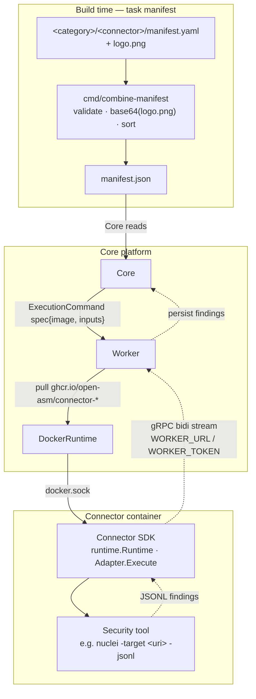

# OASM Connectors

> Pluggable security-tool connectors for the OASM platform — each tool runs as an isolated container, orchestrated by the Worker via gRPC, streaming findings back to Core.

OASM Connectors is the execution edge of the [OASM (Open Attack Surface Management)](https://github.com/open-asm) platform. Every scanner, enumerator, and vulnerability detector ships as a self-contained connector: a Go binary wrapping a security tool behind a tiny SDK adapter, packaged as a Docker image, and discovered at build time through a single aggregated manifest.

## Architecture



Flow:

1. At build time `cmd/combine-manifest` discovers every `<category>/<connector>/manifest.yaml`, validates it, base64-encodes the sibling `logo.png`, sorts by name, and writes `manifest.json`.
2. Core reads `manifest.json` to know which connectors exist, their images, capabilities, and JSON Schemas.
3. Core sends an ExecutionCommand to Worker containing spec{image, inputs}.
4. Worker pulls the image and starts it via DockerRuntime over docker.sock.
5. Inside the container the SDK runtime dials Worker (`WORKER_URL`, `WORKER_TOKEN`) and dispatches work to Adapter.Execute; findings stream back over gRPC and are persisted by Core.

> `ponytail:` `sdk/runtime.Runtime.Run` currently blocks on `ctx.Done()` — the real Worker bidi dial and command/event multiplexing lands when the Worker proto is finalized. `proto/` and `task proto` are stubs until then.

## Prerequisites

| Requirement | Version | Purpose | Required? |
|---|---|---|---|
| Go | 1.22+ (toolchain 1.24.4 via `go.mod`) | Build, vet, test, run `combine-manifest` | Yes |
| [Task](https://taskfile.dev) | 3.x | Task runner (`Taskfile.yml`) | Yes (or invoke `go` directly) |
| Docker | 20.10+ | Build & run connector images; Worker uses `docker.sock` | Yes for connector images |
| buf / protoc | latest / 3.20+ | Regenerate gRPC stubs from `proto/` | Only when editing `.proto` files |
| Git | 2.x | Clone & version control | Yes |

## Quick Start

```bash
# 1. Clone
git clone https://github.com/open-asm/oasm-connectors.git
cd oasm-connectors

# 2. Compile check — every package must build
task build
# equivalent: go build ./...

# 3. Run tests (verbose, no cache)
task test
# equivalent: go test ./... -v -count=1

# 4. Regenerate the aggregated manifest from all <category>/<connector>/manifest.yaml
task manifest
# equivalent: go run ./cmd/combine-manifest -root .
```

## Taskfile Usage

`Taskfile.yml` is version 3. All tasks are thin wrappers over `go` — Task adds discoverability, not magic.

| Task | Description | Command | Notes |
|---|---|---|---|
| `proto` | Generate protobuf stubs | `echo "ponytail - no proto files yet" && mkdir -p {{.PROTO_DIR}}` | Stub — requires `buf` or `protoc` once `proto/*.proto` exists. `ponytail: keep mkdir until real generation is wired.` |
| `test` | Run all tests | `{{.GO}} test ./... -v -count=1` | `-count=1` disables cache; verbose output |
| `build` | Compile check | `{{.GO}} build ./...` | Fails fast on type errors |
| `vet` | Static analysis | `{{.GO}} vet ./...` | |
| `fmt` | Format | `{{.GO}} fmt ./...` | Wraps `gofmt` |
| `tidy` | Tidy modules | `{{.GO}} mod tidy` | Sync `go.mod` / `go.sum` |
| `manifest` | Regenerate `manifest.json` | `{{.GO}} run ./cmd/combine-manifest -root .` | Discovers, validates, base64-encodes `logo.png`, sorts, writes `manifest.json` |
| `default` | Default task | `deps: [test]` | Running `task` with no args runs `task test` |

### Variables

Defined in `Taskfile.yml` `vars`:

| Variable | Default | Override example |
|---|---|---|
| `GO` | `go` (`${GO:-go}`) | `GO=go1.22 task build` |
| `PROTO_DIR` | `proto` (`${PROTO_DIR:-proto}`) | `PROTO_DIR=./gen/proto task proto` |

```bash
GO=go1.22 task build
PROTO_DIR=proto task proto
GO=go1.22 PROTO_DIR=proto task test
```

### How Task Works

1. Install Task 3.x from [taskfile.dev/installation](https://taskfile.dev/installation).
2. `task --list` shows all tasks with descriptions.
3. `task <name>` runs the task; `task` alone runs `default` → `test`.
4. Every task ultimately shells out to `go` — you can always bypass Task and run the `go` command directly.

## Required Components

### Go Toolchain

- `go.mod` declares `module github.com/open-asm/oasm-connectors`, `go 1.22`, `toolchain go1.24.4`.
- Dependencies: `google.golang.org/grpc v1.64.0`, `gopkg.in/yaml.v3 v3.0.1` (+ indirect `golang.org/x/*`, `google.golang.org/protobuf`).
- Any Go 1.22+ that can auto-upgrade to 1.24.4 works; pin with `GO=go1.22` if needed.

### Task Runner

- Install from https://taskfile.dev — `task --version` should report `v3.x`.

### Docker

- Required to build connector images (`docker build -f vulnerabilities/nuclei/Dockerfile .`) and at runtime when the Worker drives containers via `docker.sock`.
- No Docker needed for `task build` / `task test` / `task manifest`.

### Proto Toolchain (optional)

- `proto/` currently contains no `.proto` files; `task proto` is a stub that prints a ponytail notice and runs `mkdir -p proto`.
- When protos are added, install `buf` (preferred) or `protoc` + `protoc-gen-go` + `protoc-gen-go-grpc`, then wire real generation into the `proto` task.

### combine-manifest Tool

`cmd/combine-manifest` is the source of truth for connector discovery:

- **Discovery:** walks `<root>/<category>/<connector>/manifest.yaml` (two levels deep). Skips `sdk/`, `scripts/`, `templates/`, `.github/`, `node_modules/`, `cmd/`, and dot-dirs. Also accepts a single `manifest.yaml` at root for single-connector repos.
- **Validation:** rejects unknown YAML fields (`KnownFields(true)` ↔ `additionalProperties: false`), enforces `name` matches `^[a-z0-9-]+$`, requires `version`, `image`, and at least one non-empty `capabilities` entry, rejects duplicate `name` across connectors.
- **Logo:** if a `logo.png` sits next to `manifest.yaml`, it is read and base64-encoded (`StdEncoding`) into the `logo` field of the JSON output.
- **Output:** connectors sorted by `name` ascending, written as `{generatedAt, connectors[]}` with `generatedAt` in RFC3339Nano UTC. Default paths: `-root` auto-detects `oasm-connectors/` under `cwd` if present, `-out` defaults to `<root>/manifest.json`.

```bash
go run ./cmd/combine-manifest -root . -out ./manifest.json
```

### manifest.yaml Contract

Every connector lives at `<category>/<name>/manifest.yaml`. The file is the **source of truth** — `manifest.json` is derived and must never be hand-edited.

```yaml
name: nuclei                          # required, ^[a-z0-9-]+$
version: 3.3.0                        # required, tool version (also Docker tag)
image: ghcr.io/open-asm/connector-nuclei:3.3.0  # required, connector image (SDK+tool), not upstream image
capabilities: [vulnerabilities]       # required, at least one non-empty string
inputsSchema:                         # JSON Schema for inputs; validated upstream by Worker/Core
  type: object
  required: [target]
  properties:
    target:
      type: string
      format: uri
  additionalProperties: false
resourceDefaults:                     # scheduler hints
  cpu: 500m
  memory: 512Mi
  timeoutSeconds: 600
# logo: never in YAML — logo.png next to this file is base64-encoded into manifest.json by combine-manifest
```

| Field | Type | Required | Notes |
|---|---|---|---|
| `name` | string | Yes | `^[a-z0-9-]+$`, unique repo-wide |
| `version` | string | Yes | Semantic version of the wrapped tool |
| `image` | string | Yes | Fully-qualified connector image ref |
| `capabilities` | string[] | Yes | e.g. `vulnerabilities`, `subdomains`, `ports` |
| `inputsSchema` | object (JSON Schema) | No | Validated upstream; unknown fields rejected |
| `resourceDefaults` | object | No | `cpu`, `memory`, `timeoutSeconds` hints |
| `logo.png` | binary (file) | No | Sibling to `manifest.yaml`; base64 into `manifest.json:logo` |

`manifest.json` is a **generated artifact** — do not edit it by hand. Edit `manifest.yaml` (and `logo.png`) then run `task manifest`.

## SDK Overview

| Package | Purpose |
|---|---|
| `sdk/connector` | Core abstraction. `Adapter` interface (`Validate(ctx, inputs)`, `Execute(ctx, inputs, out chan<- []byte)`) + `Connector` wrapper (`New`, `Validate`, `Execute` delegating to the adapter). Every connector implements `Adapter`. |
| `sdk/execution` | Per-execution context. `Context` holds `ExecutionID`, `Inputs`, optional `JobID`/`Tool`/`Image`/`TraceID`, a buffered `stream` channel (cap 16) aliased as `Out`, and cancellation via `Done()`/`Cancel()`/`Context()`. Helpers: `NewContext`, `NewContextWithDetails`, `Emit` (non-blocking, drops if full/cancelled), `EmitError` (returns `DeadlineExceeded` if full), `Stream`. `ponytail: richer JobID/TraceID populated when Worker proto lands.` |
| `sdk/runtime` | Process runtime. `Runtime` wraps a `Connector`; `New(c)` creates it, `Run(ctx)` blocks until `ctx` is cancelled and returns `ctx.Err()`. `ponytail: ceiling is dialing Worker gRPC bidi and multiplexing commands/events.` |
| `sdk/lifecycle` | Minimal state machine `init -> ready -> running -> shutdown`. `Lifecycle` with `New`, `State`, `Connect(ctx, target)` (`init->ready`), `Start` (`ready->running`), `Stop` (`running->shutdown`), `Shutdown` (any→shutdown). `ponytail: no reconnect/backoff — that lives in transport.` |
| `sdk/transport` | gRPC dial helpers. `DefaultWorkerAddr = "localhost:50051"`, `Dial(target, DialOpts{Insecure})` (lazy, validates `target`), `DialWithTLSCreds(target, creds)` (mTLS), `Connect(ctx, target)` (defaults to `DefaultWorkerAddr`, lazy insecure dial). `ponytail: mTLS creds from LoadMTLS/BuildTLSConfig; no streaming/multiplex here.` |
| `sdk/logging` | Structured logger. `Logger` with `prefix`, `traceID`, optional `sink chan []byte`; `New`, `NewWithTraceID`, `WithTraceID`, `WithSink`, `TraceID`, `Info`/`Infof`/`Error`/`Errorf`/`Debug`/`Debugf`. With sink, lines are non-blocking forwarded to channel; otherwise `log.Print`. `ponytail: ceiling is gRPC forwarding to Worker.` |

### Key Types

```go
// sdk/connector
type Adapter interface {
    Validate(ctx context.Context, inputs map[string]any) error
    Execute(ctx context.Context, inputs map[string]any, out chan<- []byte) error
}
type Connector struct{ /* adapter Adapter */ }
func New(a Adapter) *Connector

// sdk/execution
type Context struct {
    ExecutionID string
    Inputs      map[string]any
    JobID, Tool, Image, TraceID string
    Out         chan<- []byte
    // + Done() <-chan struct{}, Cancel(), Context() context.Context,
    //   Stream() <-chan []byte, Emit([]byte), EmitError([]byte) error
}

// sdk/runtime
type Runtime struct{ /* conn *Connector */ }
func New(c *connector.Connector) *Runtime
func (r *Runtime) Run(ctx context.Context) error // blocks until ctx cancelled
```

## Reference Connector: Nuclei

`vulnerabilities/nuclei/` is the reference implementation for wrapping a security tool.

| Aspect | Value |
|---|---|
| Tool | [projectdiscovery/nuclei](https://github.com/projectdiscovery/nuclei) `3.3.0` |
| Image | `ghcr.io/open-asm/connector-nuclei:3.3.0` |
| Manifest | `vulnerabilities/nuclei/manifest.yaml` (see contract above) |
| Inputs | `{"target": "https://example.com"}` — `target` is a URI string, validated upstream against `inputsSchema` |
| Resources | `cpu: 500m`, `memory: 512Mi`, `timeoutSeconds: 600` |

**Dockerfile** — multi-stage:

```dockerfile
FROM projectdiscovery/nuclei:3.3.0 AS tool
FROM golang:1.22-alpine AS builder
WORKDIR /src
COPY go.mod go.sum ./
RUN go mod download
COPY . .
RUN CGO_ENABLED=0 go build -o /out/connector ./vulnerabilities/nuclei
FROM alpine:3.20
COPY --from=tool /usr/local/bin/nuclei /usr/local/bin/nuclei
COPY --from=builder /out/connector /usr/local/bin/connector
RUN adduser -D -u 10001 connector
USER 10001
ENTRYPOINT ["/usr/local/bin/connector"]
```

**Adapter** (`adapter.go`) — `NucleiAdapter` implements `Adapter`:

- `Validate` is a no-op (inputs are validated upstream by Worker against `inputsSchema`).
- `Execute` reads `inputs["target"]`, resolves `NUCLEI_BIN` env (default `nuclei`), runs `nuclei -target <target> -jsonl`, scans stdout line-by-line (buffer up to 1 MiB), unmarshals each line as JSON (skipping banner/noise), copies valid JSONL findings to `out`; stderr tail (last 2048 bytes) is included on non-zero exit.

**Entrypoint** (`main.go`) — wires `NucleiAdapter` → `connector.New` → `runtime.New` → `Run`:

```go
adapter := &NucleiAdapter{}
conn := sdkconn.New(adapter)
rt := runtime.New(conn)
if err := rt.Run(context.Background()); err != nil && err != context.Canceled {
    log.Printf("runtime error: %v", err)
    os.Exit(1)
}
```

`ponytail: real main will Dial Worker via transport.Dial + lifecycle Connect/Ready/Run with signal handling.`

**Environment:**

| Variable | Default | Purpose |
|---|---|---|
| `WORKER_URL` | `http://localhost:50051` | Worker gRPC endpoint the connector dials |
| `WORKER_TOKEN` | (none) | Auth token for Worker (when auth is enabled) |
| `NUCLEI_BIN` | `nuclei` | Override nuclei binary path (used in tests and custom images) |

## Adding a New Connector

To add `my-tool` under category `vulnerabilities` (or any category):

### 1. Create the directory

```bash
mkdir -p vulnerabilities/my-tool
```

### 2. Write `manifest.yaml`

```yaml
name: my-tool
version: 1.0.0
image: ghcr.io/open-asm/connector-my-tool:1.0.0
capabilities: [vulnerabilities]
inputsSchema:
  type: object
  required: [target]
  properties:
    target:
      type: string
      format: uri
  additionalProperties: false
resourceDefaults:
  cpu: 500m
  memory: 512Mi
  timeoutSeconds: 600
```

`name` must match `^[a-z0-9-]+$` and be unique. `logo` is not set here.

### 3. Write `Dockerfile`

Follow the nuclei pattern — multi-stage, copy tool binary, build Go connector, run as non-root:

```dockerfile
FROM upstream/my-tool:1.0.0 AS tool
FROM golang:1.22-alpine AS builder
WORKDIR /src
COPY go.mod go.sum ./
RUN go mod download
COPY . .
RUN CGO_ENABLED=0 go build -o /out/connector ./vulnerabilities/my-tool
FROM alpine:3.20
COPY --from=tool /usr/local/bin/my-tool /usr/local/bin/my-tool
COPY --from=builder /out/connector /usr/local/bin/connector
RUN adduser -D -u 10001 connector
USER 10001
ENTRYPOINT ["/usr/local/bin/connector"]
```

### 4. Implement `adapter.go`

```go
package main

import (
    "context"
    "fmt"
)

type MyToolAdapter struct{}

func (a *MyToolAdapter) Validate(_ context.Context, _ map[string]any) error { return nil }

func (a *MyToolAdapter) Execute(ctx context.Context, inputs map[string]any, out chan<- []byte) error {
    target, _ := inputs["target"].(string)
    if target == "" {
        return fmt.Errorf("target required")
    }
    // exec tool, stream JSON findings to out
    return nil
}
```

Must satisfy `sdk/connector.Adapter` (`Validate` + `Execute`).

### 5. Wire `main.go`

```go
package main

import (
    "context"
    "log"
    "os"

    sdkconn "github.com/open-asm/oasm-connectors/sdk/connector"
    "github.com/open-asm/oasm-connectors/sdk/runtime"
)

func main() {
    rt := runtime.New(sdkconn.New(&MyToolAdapter{}))
    if err := rt.Run(context.Background()); err != nil && err != context.Canceled {
        log.Printf("runtime error: %v", err)
        os.Exit(1)
    }
}
```

### 6. Add `logo.png` (optional but recommended)

Place a `logo.png` next to `manifest.yaml` — it will be base64-encoded into `manifest.json` automatically.

### 7. Regenerate the aggregated manifest

```bash
task manifest
# or: go run ./cmd/combine-manifest -root . -out ./manifest.json
```

Verify `manifest.json` now contains your connector sorted by `name`.

### 8. Test

```bash
go test ./vulnerabilities/my-tool/... -v -count=1
task test   # full repo
```

## Development Workflow

```bash
# List tasks
task --list

# Compile check (all packages)
task build
go build ./...

# Static analysis
task vet
go vet ./...

# Format
task fmt
go fmt ./...

# Tidy modules after adding/removing deps
task tidy
go mod tidy

# Run all tests (verbose, no cache)
task test
go test ./... -v -count=1

# Run a single package
go test ./sdk/execution -v -count=1
go test ./cmd/combine-manifest -v -count=1
go test ./vulnerabilities/nuclei -v -count=1

# Regenerate manifest.json after editing any manifest.yaml or logo.png
task manifest
go run ./cmd/combine-manifest -root . -out ./manifest.json

# Custom Go binary or proto dir
GO=go1.22 task build
PROTO_DIR=proto task proto

# Default task (runs test)
task
```

## Testing

Tests are standard `go test` with no external dependencies (no Docker, no network).

```bash
# All packages
task test
go test ./... -v -count=1

# Single package
go test ./sdk/connector -v -count=1
go test ./sdk/execution -v -count=1
go test ./sdk/lifecycle -v -count=1
go test ./sdk/logging -v -count=1
go test ./sdk/transport -v -count=1
go test ./cmd/combine-manifest -v -count=1
go test ./vulnerabilities/nuclei -v -count=1

# With race detector
go test ./... -race -count=1
```

Coverage by package (each SDK package and `combine-manifest` / `nuclei` has its own `*_test.go`):

- `sdk/connector` — Adapter delegation
- `sdk/execution` — Context creation, cancellation, Emit/EmitError, channel aliasing
- `sdk/lifecycle` — State transitions `init->ready->running->shutdown`, idempotency
- `sdk/logging` — Prefix/trace formatting, sink vs std log, non-blocking write
- `sdk/transport` — Dial validation, DefaultWorkerAddr fallback, Connect
- `cmd/combine-manifest` — Discovery, validation, logo encoding, sorting, duplicate detection
- `vulnerabilities/nuclei` — Validate no-op, Execute target validation, JSONL filtering

## Project Structure

```
oasm-connectors/
├── Taskfile.yml                    # Task runner (version 3) — build/vet/fmt/tidy/test/manifest/proto
├── go.mod / go.sum                 # module github.com/open-asm/oasm-connectors, go 1.22, grpc + yaml.v3
├── manifest.json                   # GENERATED — aggregated connector catalog (do not hand-edit)
├── proto/                          # gRPC stubs (ponytail stub until Worker proto lands)
├── cmd/
│   └── combine-manifest/
│       ├── main.go                 # discovers <category>/<connector>/manifest.yaml, validates, base64 logo.png, sorts, writes manifest.json
│       └── main_test.go
├── sdk/
│   ├── connector/
│   │   ├── connector.go            # Adapter interface (Validate, Execute) + Connector wrapper
│   │   └── connector_test.go
│   ├── execution/
│   │   ├── context.go              # Context{ExecutionID, Inputs, JobID/Tool/Image/TraceID, Out, Emit, Done/Cancel}
│   │   ├── stream.go
│   │   └── context_test.go
│   ├── lifecycle/
│   │   ├── lifecycle.go            # init -> ready -> running -> shutdown state machine
│   │   └── lifecycle_test.go
│   ├── logging/
│   │   ├── logging.go              # Logger{prefix, traceID, sink} with Info/Error/Debug
│   │   └── logging_test.go
│   ├── runtime/
│   │   └── runtime.go              # Runtime{conn} — Run blocks until ctx cancelled (ponytail stub)
│   └── transport/
│       ├── transport.go            # Dial / DialWithTLSCreds / Connect (DefaultWorkerAddr localhost:50051)
│       ├── mtls.go
│       └── transport_test.go
└── vulnerabilities/
    └── nuclei/                     # reference connector
        ├── manifest.yaml           # source of truth (name, version, image, capabilities, inputsSchema, resourceDefaults)
        ├── Dockerfile              # multi-stage: COPY --from=projectdiscovery/nuclei:3.3.0 + go build
        ├── main.go                 # wires NucleiAdapter + SDK runtime
        ├── adapter.go              # NucleiAdapter.Validate (no-op) + Execute (nuclei -target <uri> -jsonl)
        ├── adapter_test.go
        ├── logo.png                # base64-encoded into manifest.json
        └── README.md
```

## License

[GPL-3.0](LICENSE) — see [LICENSE](LICENSE) for full terms.

> `ponytail:` notes throughout this README mark intentional stubs whose ceiling is documented inline (runtime bidi, proto generation, lifecycle reconnect, transport mTLS, logging gRPC forwarding). They are not TODOs to ignore — they define the upgrade path when the Worker contract lands.

