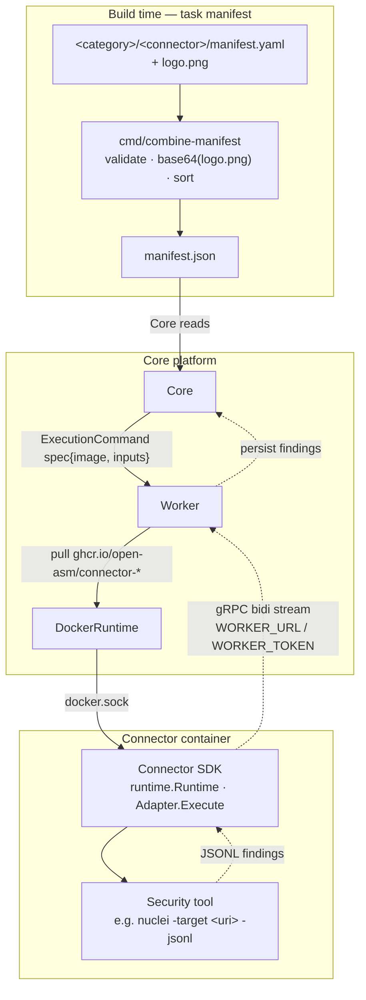

# OASM Connectors

Pluggable security-tool connectors for the [OASM platform](https://github.com/oasm-platform/open-asm). Each security tool ships as an isolated Docker image wrapping a tiny Go SDK adapter. Connectors are discovered at build time through a single aggregated manifest, orchestrated by the Worker over gRPC, and stream findings back to Core.

## Architecture



Flow:

1. At build time `cmd/combine-manifest` discovers every `<category>/<connector>/manifest.yaml`, validates it, base64-encodes the sibling `logo.png`, and writes `manifest.json`.
2. Core reads `manifest.json`, then sends an ExecutionCommand spec{image, inputs} to Worker.
3. Worker pulls the connector image and starts it via DockerRuntime (`docker.sock`).
4. Inside the container the SDK runtime dials Worker (`WORKER_URL` / `WORKER_TOKEN`) and streams JSONL findings back over gRPC; Core persists them.

> `ponytail:` real Worker bidi dial lands when the Worker proto is finalized — `proto/` and `task proto` are stubs until then.

## Prerequisites

Go 1.22+, [Task](https://taskfile.dev) 3.x, Docker 20.10+ (only for building/running connector images). `buf`/`protoc` only when editing `.proto` files.

## Quick Start

```bash
git clone https://github.com/open-asm/oasm-connectors.git && cd oasm-connectors
task build      # compile check (go build ./...)
task test       # go test ./... -v -count=1
task manifest   # regenerate manifest.json from all manifest.yaml files
```

All tasks are thin wrappers over `go` — run the equivalent command directly if you prefer.

## Connector Contract

Every connector lives at `<category>/<name>/manifest.yaml`. It is the source of truth; `manifest.json` is generated — never hand-edit it.

```yaml
name: nuclei # required, ^[a-z0-9-]+$, unique repo-wide
version: 3.3.0 # wrapped tool version (also Docker tag)
image: ghcr.io/open-asm/connector-nuclei:3.3.0 # required
capabilities: [vulnerabilities] # required, at least one entry
inputsSchema: # JSON Schema, validated upstream by Worker/Core
  type: object
  required: [target]
  properties:
    target: { type: string, format: uri }
  additionalProperties: false
resourceDefaults: # scheduler hints
  cpu: 500m
  memory: 512Mi
  timeoutSeconds: 600
```

An optional `logo.png` next to `manifest.yaml` is base64-encoded into `manifest.json` automatically by `task manifest`.

## Adding a New Connector

1. Create the directory: `mkdir -p vulnerabilities/my-tool`
2. Write `manifest.yaml` (contract above) and optionally a `logo.png`.
3. Write a multi-stage `Dockerfile`: copy the upstream tool binary + build the Go connector, run as non-root (copy the pattern from `vulnerabilities/nuclei/Dockerfile`).
4. Implement `sdk/connector.Adapter` — `Validate(ctx, inputs)` plus `Execute(ctx, inputs, out chan<- []byte)` that runs the tool and streams JSONL findings to `out`.
5. Wire `main.go`: `runtime.New(connector.New(&MyAdapter{})).Run(context.Background())`.
6. Regenerate and verify: `task manifest && task test`.

Reference implementation: [`vulnerabilities/nuclei`](vulnerabilities/nuclei) (wraps nuclei `-target <uri> -jsonl`; env: `WORKER_URL`, `WORKER_TOKEN`, `NUCLEI_BIN`).

## Testing

Standard `go test`, no Docker or network needed:

```bash
go test ./... -race -count=1          # everything
go test ./vulnerabilities/nuclei -v   # one package
```

Each SDK package (`connector`, `execution`, `lifecycle`, `logging`, `transport`) plus `cmd/combine-manifest` and each connector has its own tests.

## License

[GPL-3.0](LICENSE).
