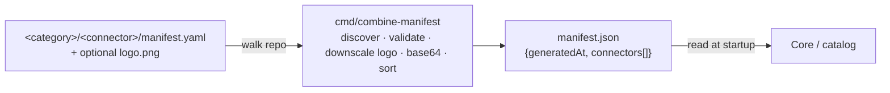
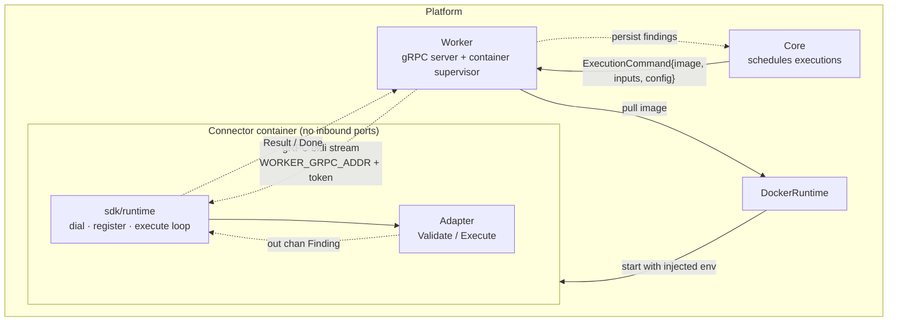
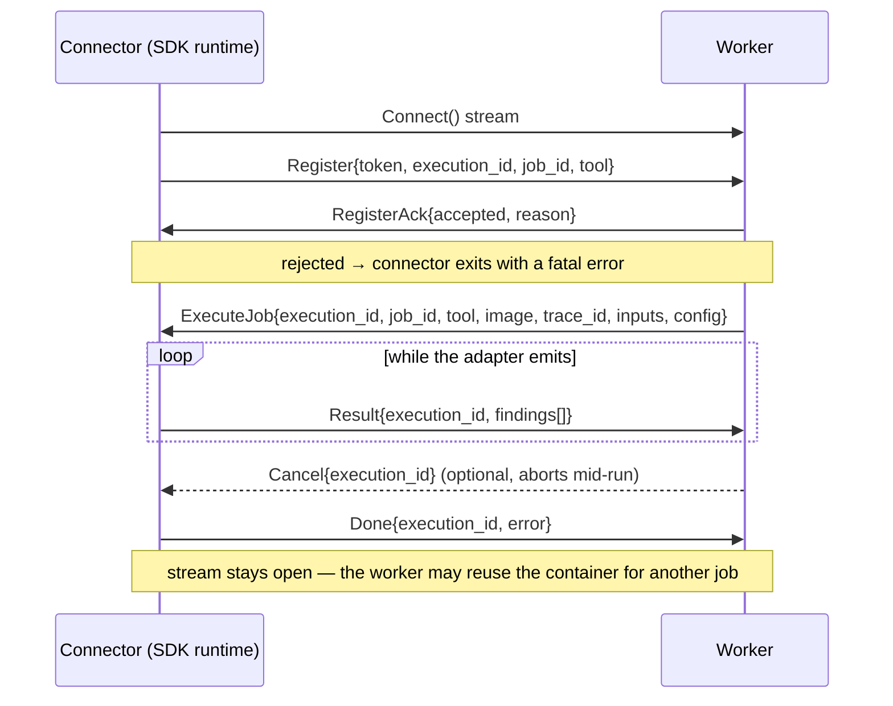

# OASM Connectors

Connector framework for the [OASM platform](https://github.com/oasm-platform/oasm-connectors). A connector packages one external security tool behind a uniform contract: a declarative `manifest.yaml` describing how it is discovered and scheduled, and a Go binary that adapts the tool's output into the platform's canonical `Finding` stream.

The same skeleton serves every kind of tool — in-process library embedding, CLI wrapper, or remote API client — because nothing outside the adapter knows which one it is. This document describes the framework itself: architecture, contracts, and the steps to add a connector. It intentionally names no specific tool.

## Architecture

### Build time — capability aggregation



`manifest.json` is a generated artifact. It is the only thing the platform catalog consumes; the per-connector `manifest.yaml` files are the source of truth.

### Runtime — execution path



### Wire protocol — one bidirectional stream



Key properties:

- **Outbound only.** The connector never listens; it dials the Worker address injected into its environment.
- **One execution at a time per stream.** `Runtime` gates executions so per-job process state (restored config, working directory, tool globals) is never raced.
- **Container reuse (warm pool).** After `Done` the process stays alive for the next `ExecuteJob`, so adapters must tolerate being executed more than once in one process.
- **Cancellation is a protocol message.** `Cancel` aborts the running execution's context; the adapter is expected to return promptly, and the SDK bounds the wait.
- **No silent drops.** Every `Finding` is validated before transport. An invalid one stops the stream, cancels the execution, and is reported on `Done` as a fatal error.
- **Panics are contained.** A panicking adapter is recovered and reported as a retryable error; the process survives to serve the next job.

## Repository layout

A multi-module Go monorepo. The root module holds only the manifest tooling; each connector is an independent module that consumes the SDK through a local `replace` directive.

```
.
├── cmd/combine-manifest/     root module — manifest discovery/validation/aggregation
├── sdk/                      its own module — the connector SDK (imported by every connector)
│   ├── connector/            Adapter interface + Finding type and validation
│   ├── runtime/              dial Worker, register, execute loop, stream findings
│   ├── env/                  Worker-injected configuration and INPUT_* parsing
│   ├── transport/            gRPC dialing, plaintext and mTLS credentials
│   ├── execution/            per-execution context and stream helpers
│   ├── lifecycle/            init → ready → running → shutdown state machine
│   ├── logging/              leveled logger
│   └── proto/                connector.proto and the generated stubs in proto/gen
├── <category>/<connector>/   one module per connector
│   ├── manifest.yaml         the connector contract (required)
│   ├── logo.png              optional icon, inlined into manifest.json
│   ├── Dockerfile            build context is the repo root
│   ├── main.go               wiring only
│   └── adapter + tests
├── manifest.json             generated — never hand-edit
├── go.work                   unifies every module for root-level tooling
└── Taskfile.yml              task runner entry points
```

Consequences worth respecting:

- A dependency added for one connector lands only in that connector's `go.mod`. Never promote a tool-specific dependency into the SDK or the root module.
- Module-scoped commands must run inside the module's directory. `go test ./...` at the root does not reach the connectors.
- `go.work` makes commands work from the root for convenience, but CI and `task tidy` deliberately set `GOWORK=off` so each module stays independently reproducible.

## Connector contract

### `manifest.yaml`

Written by hand, validated at aggregation time. Unknown fields are rejected, so typos fail the build instead of silently doing nothing.

| Field | Required | Notes |
| --- | --- | --- |
| `name` | yes | Human display name. Free-form, may contain spaces and uppercase. |
| `slug` | yes | System-wide unique ID, `^[a-z0-9-]+$`. Drives the image tag and container naming. |
| `version` | yes | Version of the wrapped tool. Used as the default image tag. |
| `image` | yes | Fully qualified image reference for the build. |
| `author` | yes | Maintainer. |
| `pricingTier` | yes | Non-empty list of `free` / `paid` (case-normalized). |
| `shortDescription` | yes | One line, shown in list views. |
| `description` | yes | Full paragraph for the detail view. |
| `capabilities` | yes | At least one non-empty entry; also drives directory grouping by category. |
| `homepage` | no | Non-empty string when set. |
| `repositoryUrl` | no | Non-empty string when set. |
| `supportUrl` | no | Non-empty string when set. |
| `inputsSchema` | no | JSON Schema for the per-run inputs the operator supplies. Validated upstream by Core/Worker. |
| `configSchema` | no | JSON Schema for the tool profile. Adapters read it as `OASM_CONFIG`. |
| `resourceDefaults` | no | Scheduler hints, e.g. `cpu`, `memory`, `timeoutSeconds`. |

Schemas use plain JSON Schema plus two loosely-conventional annotation keys — `title` and `description` for labelling, and `ui:placeholder` for input hints. Only `type`, `required`, `properties`, `items`, `enum`, `default`, `examples` and `format` carry validation weight; annotations are for rendering.

Aggregation rules:

- A `logo.png` sibling is read and downscaled to a 128px long edge if larger (never upscaled or re-encoded when already within budget), then embedded base64 in `manifest.json`. An oversized `logo.png` is rewritten in place, so the repo file is byte-identical to the embedded icon. Logos never appear in YAML.
- Duplicate slugs across the repo are a hard error.
- `manifest.json` entries are sorted by `name`, and its `generatedAt` timestamp makes every regeneration a diff.

### Adapter

The only code every connector must write. Two methods, no lifecycle ceremony beyond constructing it:

```go
type Adapter interface {
    // Validate rejects inputs that the tool cannot possibly run, before any
    // container or network resource is spent.
    Validate(ctx context.Context, inputs map[string]any) error

    // Execute runs the tool and streams findings to out. It must honour ctx
    // cancellation and must not close out — the runtime owns the channel.
    Execute(ctx context.Context, inputs map[string]any, out chan<- Finding) error
}
```

Error convention — the Worker uses this to decide whether to retry:

- `fatal: …` — configuration, credentials, or target problems. Retrying will not help.
- `retryable: …` — transient failures: dial, stream, timeouts, adapter/scanner errors, cancellation.
- The SDK applies the prefix to errors it raises itself; adapters are expected to do the same.

### `Finding`

The canonical output item. `name` is required and `severity` must be one of `info`, `low`, `medium`, `high`, `critical` — anything else is a protocol violation, not noise.

| Group | Fields |
| --- | --- |
| Identity | `Name`, `Severity`, `Timestamp` |
| Content | `Description`, `Solution`, `Tags`, `References` |
| Scoring | `CVEID`, `CWEID`, `CVSSScore`, `CVSSMetrics`, `EPSSScore` |
| Location | `MatchedAt`, `Host`, `IP` |

`Timestamp` is omitted from the wire when zero rather than shipped as bogus epoch time.

### Environment (injected by the Worker)

Connectors are never configured by flags or files; everything arrives as environment variables.

| Variable | Required | Purpose |
| --- | --- | --- |
| `WORKER_GRPC_ADDR` | yes | Worker gRPC endpoint. Missing → fail fast with a fatal error (a connector outside the Worker cannot be routed any work). |
| `EXECUTION_ID` | yes | Execution identity used to route `ExecuteJob`. Missing → fail fast, unless the legacy opt-out below is set. |
| `OASM_ALLOW_LEGACY_NO_EXEC_ID` | no | Set to keep the legacy no-`ExecuteJob` behavior when `EXECUTION_ID` is absent. |
| `WORKER_TOKEN` | no | Registration token; the Worker may reject the `Register` without it. |
| `JOB_ID`, `TOOL`, `TRACE_ID` | no | Enriched identity, echoed in logs for correlation. |
| `WORKER_TLS_CA`, `WORKER_TLS_CERT`, `WORKER_TLS_KEY` | no | mTLS for the Worker dial. Applied only when **all three** are set; otherwise the dial is plaintext. |
| `INPUT_*` | no | Per-run inputs. `INPUT_TARGET` becomes `inputs["target"]`; keys are lowercased and the prefix stripped. |
| `OASM_CONFIG` | no | The job's config profile as JSON. A container reused from the warm pool gets its profile replaced around each `ExecuteJob`, so adapters must read it at execution time, not at startup. |
| `LOG_LEVEL` / `OASM_LOG_LEVEL` | no | Set to `debug` for the verbose trace (per-result lines, emitted-finding previews, dial details). INFO and above are always on. |
| `OASM_LOG_COLOR` | no | `always` forces ANSI colour, `never` strips it. Unset means "colour only when stderr is a terminal" — which is off in a container, so the Worker's captured logs stay plain text. `NO_COLOR` (any value) also forces colour off. |

Input precedence: Worker-provided per-job inputs override `INPUT_*` environment defaults.

### Container logs (tracing a job)

Everything the SDK prints goes to stderr, which the Worker tails from the container and keeps as the job's log. For a connector written on this SDK the SDK itself emits the trace:

- `connector starting` / `worker config` — process identity, dial address, whether a token/TLS is configured.
- `execute start` + `effective inputs` — the ExecuteJob identity, plus the inputs and config the adapter actually sees, truncated and with credential-shaped keys redacted (`token=<redacted>`). Secrets never reach these lines because the platform persists them.
- `first finding` and per-result `streamed result N` (debug) — proof the tool produced parseable output, which is what separates "scanned and found nothing" from "output failed to parse".
- `adapter panic: …` with a stack, `adapter error after N result(s) in <duration>`, `execution done: results=N elapsed=<duration> error=<none|…>`.

Lines are coloured by level — `DEBUG` dim, `INFO` cyan, `SUCCESS` green, `WARN` yellow, `ERROR` red — with the `[level]` label always present so the text stays greppable when colour is off. `SUCCESS` is the terminal good-outcome line (`registered with worker`, `execution done: results=N`); a run that ends carrying an error logs the same line at `WARN`. Print a sample of the format (real ANSI, no connector build needed):

```bash
cd sdk && OASM_LOG_COLOR=always LOG_LEVEL=debug go test ./logging/ -run TestPrintSample -v
```

Every line carries `trace_id` plus `execution_id`, `job_id`, `tool` and `image` fields, so one job's lines can be grepped out of a warm-pool container that serves many jobs in a single log stream.

## Adding a connector

1. **Create the module directory** as `<category>/<slug>`. The category is free-form and should match the connector's `capabilities` entry; it becomes the grouping in the catalog.
2. **Create the Go module.** Its own `go.mod`, module path `<repo module path>/<category>/<slug>`, requiring the SDK at `v0.0.0` with `replace <sdk module path> => ../../sdk`. Run `go mod tidy` with `GOWORK=off`.
3. **Write `manifest.yaml`** against the contract above, plus an optional `logo.png`.
4. **Write a multi-stage `Dockerfile`.** Build context is the repo root, so copy `sdk/` and the connector directory explicitly. Drop both `go.mod`/`go.sum` files first and run `go mod download` before copying sources so dependency layers cache. Build statically (`CGO_ENABLED=0`), land a single binary on a minimal base image, create an unprivileged user, and `USER` it. The image must not expose ports or require a shell.
5. **Implement the adapter.** `Validate` should reject malformed inputs early and cheaply. `Execute` should stream findings as they are produced rather than buffering the whole run, return on `ctx.Done()`, and never close `out`. Keep tool-specific code in this package and nowhere else.
6. **Wire `main.go`** — construct the adapter, wrap it, run it, and treat a cancelled context as a clean exit rather than a failure.
7. **Add tests.** Adapter tests must run without Docker or network: a fake tool binary or an injected client covers parsing, severity mapping, error mapping, and cancellation. Unit-test the adapter, not the SDK.
8. **Regenerate and verify** — `task manifest && task test`.
9. **Publish** — via the workflow's manual dispatch (see CI below), which derives the matrix from every `<category>/<slug>/manifest.yaml`.

Design notes for the adapter:

- **Prefer in-process embedding over a CLI wrapper** where the tool offers a library: no subprocess lifecycle, no output-format drift, cancellation propagates naturally. Wrap a CLI only when no usable library exists, and then guard the contract with a fake binary in `testdata/`.
- **Remote-API tools ship no bundled binary at all** — the adapter is the client, and credentials belong in `configSchema`, never in code or the image.
- **Map severities explicitly.** Collapse the tool's own scale onto the five-value enum with a table, not with string guessing.
- **Never leak secrets into findings or logs.** Findings are persisted and displayed; config values are not.

## Building and testing

Prerequisites: Go 1.26+, [Task](https://taskfile.dev) 3.x, and Docker 20.10+ for building or running images (`buf`/`protoc` only when regenerating protobuf stubs).

```bash
task test        # go test per module in Taskfile MODULES
task vet         # go vet per module
task fmt         # gofmt per module
task tidy        # go mod tidy per module with GOWORK=off
task manifest    # regenerate manifest.json
task proto       # protobuf generation — currently a stub; stubs are committed under sdk/proto/gen
```

Every task is a thin wrapper over `go`; run the equivalent command directly when working inside a single module.

Tests need no Docker, no network, and no credentials, and are the primary gate: CI runs the same `go test` on every module with `GOWORK=off`. A connector is not mergeable until its adapter's parsing, error mapping, and cancellation paths are covered.

## CI and publishing

The connector workflow is path-filtered to `sdk/**`, `ports_scanner/**`, `vulnerabilities/**`, `url_discovery/**` and the workflow file itself.

- **On push / pull request** — discover every `<category>/<slug>/manifest.yaml`, derive a build matrix from `slug` and `version`, run the full test suite, then build each image with `push: false`. Nothing is published.
- **On manual dispatch** — the same pipeline, plus a push job that publishes `connector-<slug>:<version>` and `:latest` to the registry. A `dry_run` input builds and tests without publishing, and an `image_tag` input overrides the tag.
- Registry credentials come from the CI token; local builds never require them.

Because publication is manual and tag-driven, the `version` field in `manifest.yaml` is meaningful: bumping it is what produces a new immutable image tag.

## Design constraints

- **The SDK is the only shared code.** Anything tool-specific that leaks upward makes every connector heavier and the contract fuzzier.
- **`manifest.json` is derived.** Regenerate it; never edit or patch it by hand.
- **The contract is validated, not trusted.** Unknown manifest fields, duplicate slugs, empty capabilities, and invalid pricing tiers all fail the build.
- **The container is the boundary.** Connectors must run unprivileged with no inbound network surface, and must tolerate warm-pool reuse.

## License

[Apache-2.0](LICENSE), with attribution notices in [NOTICE](NOTICE).
